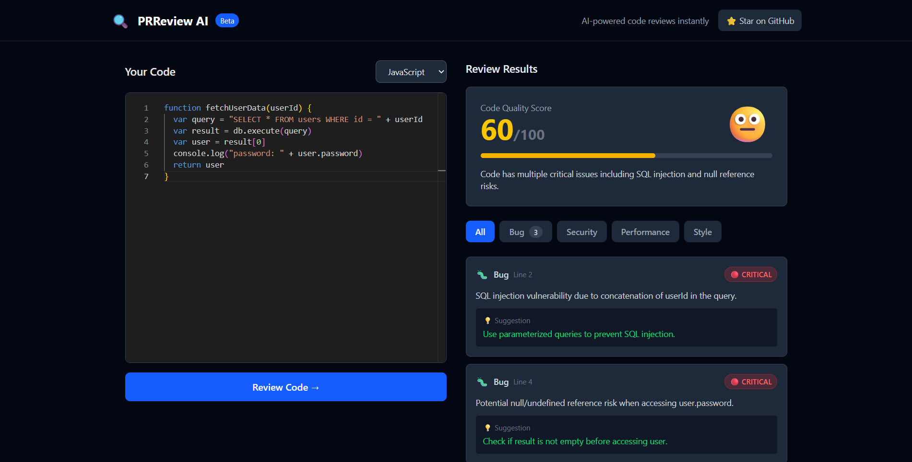
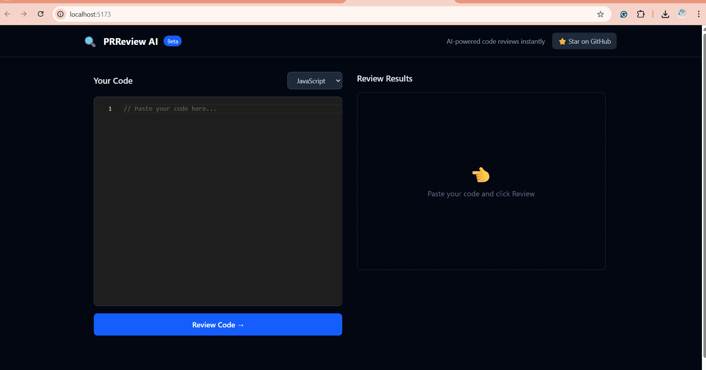

# PRReview AI 🔍

An AI-powered code review tool that analyzes your code and provides structured, actionable feedback — instantly. Built with React, ASP.NET Core, and OpenAI GPT.





<!-- ## 🚀 Live Demo -->
<!-- [prreview-ai.vercel.app](https://prreview-ai.vercel.app) Update after deployment -->

---

## ✨ Features

- **Instant Code Review** — Paste any code and get a structured AI review in seconds
- **Categorized Feedback** — Issues grouped by Bugs, Security, Performance, and Style
- **Severity Levels** — Critical, Warning, and Suggestion badges for each issue
- **Code Quality Score** — Overall score out of 100 with visual progress bar
- **Multi-language Support** — JavaScript, TypeScript, Python, C#, Java, C++
- **Monaco Editor** — Same editor used in VS Code, with syntax highlighting

---

## 🛠️ Tech Stack

| Layer | Technology |
|---|---|
| Frontend | React + Vite + Tailwind CSS |
| Code Editor | Monaco Editor |
| Backend | ASP.NET Core Web API (C#) |
| AI | OpenAI GPT-4o-mini |
| Containerization | Docker + Docker Compose |
| Deployment | Vercel (frontend) + Azure App Service (backend) |

---

## 📁 Project Structure

```
prreview-ai/
├── frontend/                  
│   └── src/
│       ├── components/
│       │   ├── IssueCard.jsx
│       │   ├── LanguageSelector.jsx
│       │   ├── ReviewResults.jsx
│       │   ├── ScoreCard.jsx
│       │   └── SeverityBadge.jsx
│       ├── services/
│       │   └── reviewService.js
│       └── App.jsx
│
├── backend/                   
│   └── PRReviewAI.Api/
│       ├── Controllers/
│       │   └── ReviewController.cs
│       ├── Models/
│       │   ├── ReviewRequest.cs
│       │   └── ReviewResult.cs
│       └── Services/
│           └── OpenAIService.cs
│
├── .env.example               
├── docker-compose.yml         
└── README.md
```

---

## 🏃 Running Locally

### Prerequisites
- Docker Desktop
- OpenAI API key from [platform.openai.com](https://platform.openai.com/api-keys)

### Setup

```bash
# Clone the repo
git clone https://github.com/PradnyaChanne/prreview-ai.git
cd prreview-ai

# Create your .env file
cp .env.example .env
# Add your OpenAI API key to .env

# Start everything with Docker
docker-compose up --build
```

Open `http://localhost:5173` in your browser.

---

## 🔑 Environment Variables

Create a `.env` file in the root directory:

```
OPENAI_API_KEY=your-openai-api-key-here
```

---

## 🗺️ Roadmap

- [x] Core review pipeline with OpenAI integration
- [x] React frontend with Monaco Editor
- [x] Categorized issues with severity levels
- [x] Code quality scoring
- [ ] GitHub OAuth login
- [ ] PR diff fetching and per-file review
- [ ] Post review comments directly on GitHub PRs
- [ ] Review history

---

## 🤝 Contributing

Contributions are welcome! Please open an issue first to discuss what you'd like to change.

1. Fork the repo
2. Create your branch (`git checkout -b feature/your-feature`)
3. Commit your changes (`git commit -m 'Add some feature'`)
4. Push to the branch (`git push origin feature/your-feature`)
5. Open a Pull Request

---

## 📄 License

MIT License — see [LICENSE](LICENSE) for details.

---

## 👩‍💻 Author

**Pradnya Channe**
- GitHub: [@PradnyaChanne](https://github.com/PradnyaChanne)
- LinkedIn: [pradnya-channe](https://linkedin.com/in/pradnya-channe-93472b221)
